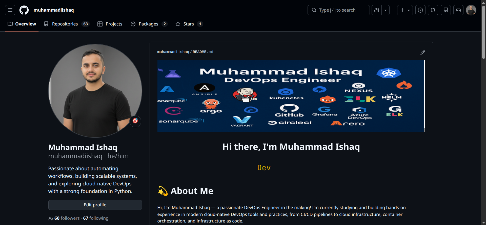
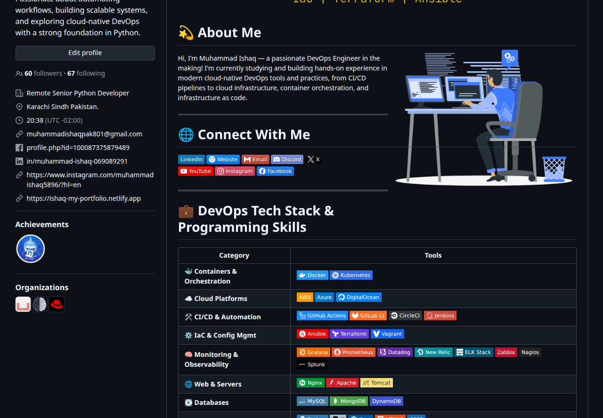

## Day 27 – GitHub Profile Makeover: Build Your Developer Identity

### Task 1: Audit Your Current GitHub Profile
Before making changes, assess where you stand:
1. Visit your own GitHub profile as if you were a stranger — what impression does it give?
   **Answer**
        Its give me best Like I have customize will but some things that I did't not have done yet I will do after this task which are mentions.  
3. Answer in your notes:
   - Is your profile picture professional? - **Yes**
   - Is your bio filled in? Does it say what you do? - **Yes its related my filed I have filled**
   - Are your pinned repos relevant, or are they random forks? - **Relevant**
   - Do your repos have descriptions, or are they blank? - **Yes some of have and some of not**
   - Would a recruiter understand what you've been working on? - **Yes**

---

### Task 2: Create Your Profile README

* **Yes I have created Profile Readme file**
*    [Checkout my profile](https://github.com/muhammadiishaq)

---

## Task 3: Organize Your Repositories

1. **90 Days of DevOps** — 
    
    * [90 Days of DevOps Repository](https://github.com/muhammadiishaq/90DaysOfDevOps)

2. **Shell Scripts** I have created my shell scripting repo where i will put important shell files.

    * [Shell Scripts Repository](https://github.com/muhammadiishaq/Shell_scripting)

3. **Python Scripts**  I have dedicated repo for my Python projects

    * [Python Repository](https://github.com/muhammadiishaq/Python_project_for_devops)

4. **DevOps Notes** — I have repo for my learning notes, cheat sheets, and references

    * [DevOps Notes](https://github.com/muhammadiishaq/DevOps_Notes)

---

### Task 4: Pin Your Best Repos

* **Pinned** I have pin my best repo.

---

### Task 5: Clean Up Repo

**I have clean up repo not empty are archive repo. every repo have will name**

### Task 6: Before & After.

   
   
   
 
    
