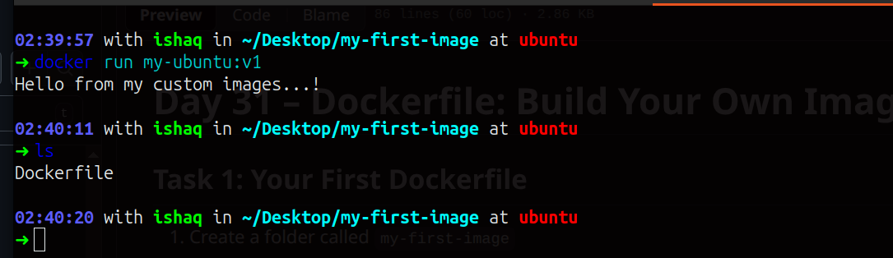
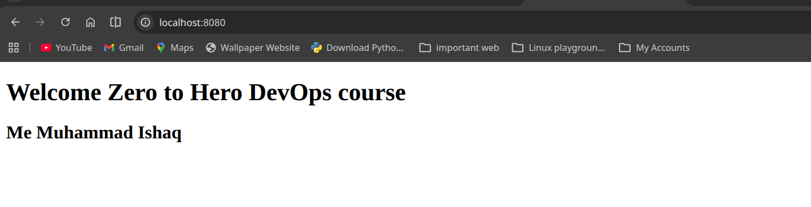
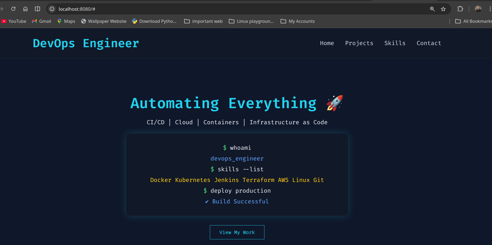

# Day 31 – Dockerfile: Build Your Own Images

Today we learn how to create our own Docker images using a Dockerfile.
This is very important if you want to build and ship real applications using Docker.

## Task 1: Create Your First Docker Image
Step 1: Create a Folder
```
mkdir my-first-image
cd my-first-image
```
Step 2: Create a Dockerfile
```
vim Dockerfile
```
Add this code inside it:

```
from ubuntu:latest

# instalation and update 

RUN apt-get update && apt install curl -y

CMD ["echo","Hello from my custom images...!"]

#ENTRYPOINT ["echo","hi"]
```

Step 3: Build the Image
```
docker build -t my-ubuntu:v1 .
```
This creates an image named my-ubuntu with tag v1.

Step 4: Run the Container and see picture.


```
docker run my-ubuntu:v1
✅ Output:
Hello from my custom image!
```


---
## Task 2: Practice Dockerfile Instructions

Create a new Dockerfile that uses **all** of these instructions:
- `FROM` — base image
- `RUN` — execute commands during build
- `COPY` — copy files from host to image
- `WORKDIR` — set working directory
- `EXPOSE` — document the port
- `CMD` — default command

Build and run it. Understand what each line does.

Dockerfile...:

```
FROM nginx:alpine

# Set working directory
WORKDIR /usr/share/nginx/html

# Remove default nginx html files
RUN rm -rf ./*

# Copy our custom HTML file
COPY index.html .

# Expose port 80
EXPOSE 80

# Start nginx
CMD ["nginx", "-g", "daemon off;"]
```


---
## Task 3: CMD vs ENTRYPOINT

1. **CMD**  If you create an image with CMD ["echo", "hello"] and run it, it prints hello. If you run it with a custom command, that command replaces the default.

2. **ENTRYPOINT**  If you create an image with ENTRYPOINT ["echo"] and run it, it prints what you pass as arguments. Any extra arguments you give when running the container are added to the command.

Notes:

- CMD → Sets default commands, but can be overridden at runtime.

- ENTRYPOINT → Forces a command to always run, with extra arguments appended.

 **In short is...**
 
 CMD is for flexible defaults, ENTRYPOINT is for fixed main commands.

## Task 4: Build a Simple Web App Image
1. Create a small static HTML file (`index.html`) with any content
2. Write a Dockerfile that:
   - Uses `nginx:alpine` as base
   - Copies your `index.html` to the Nginx web directory
3. Build and tag it `my-website:v1`
4. Run it with port mapping and access it in your browser


    
---

## Task 5: Using .dockerignore..

Create a file named:..
```
vim .dockerignore
```

Add those which you want to ignore while image are building.
```
node_modules
.git
*.md
.env
```

This prevents unnecessary files from being copied into the image.
It makes builds faster and images smaller.
---

## Task 6: Build Optimization

- Every instruction in a Dockerfile (like FROM, COPY, RUN) creates its own layer in the image.

- Docker keeps a cache of these layers, so any layers that haven’t changed don’t need to be rebuilt.

- If a layer is modified, all the layers that come after it are rebuilt from scratch.

- Putting the lines that change frequently at the bottom helps Docker reuse more layers and speeds up the build process.

- This approach makes building images faster and more efficient.

---
