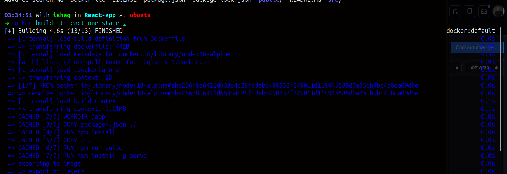
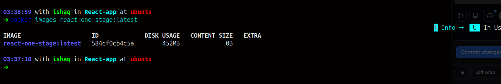
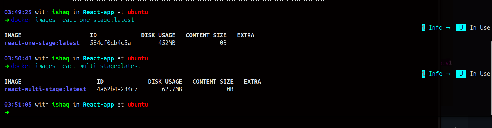
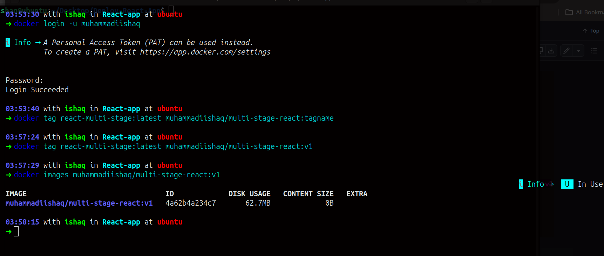
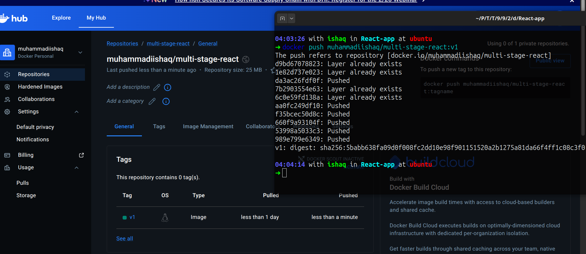
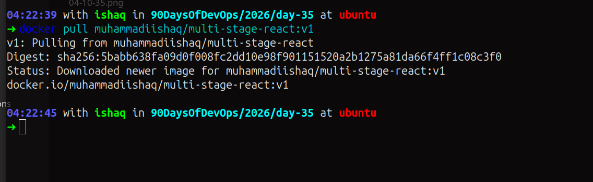
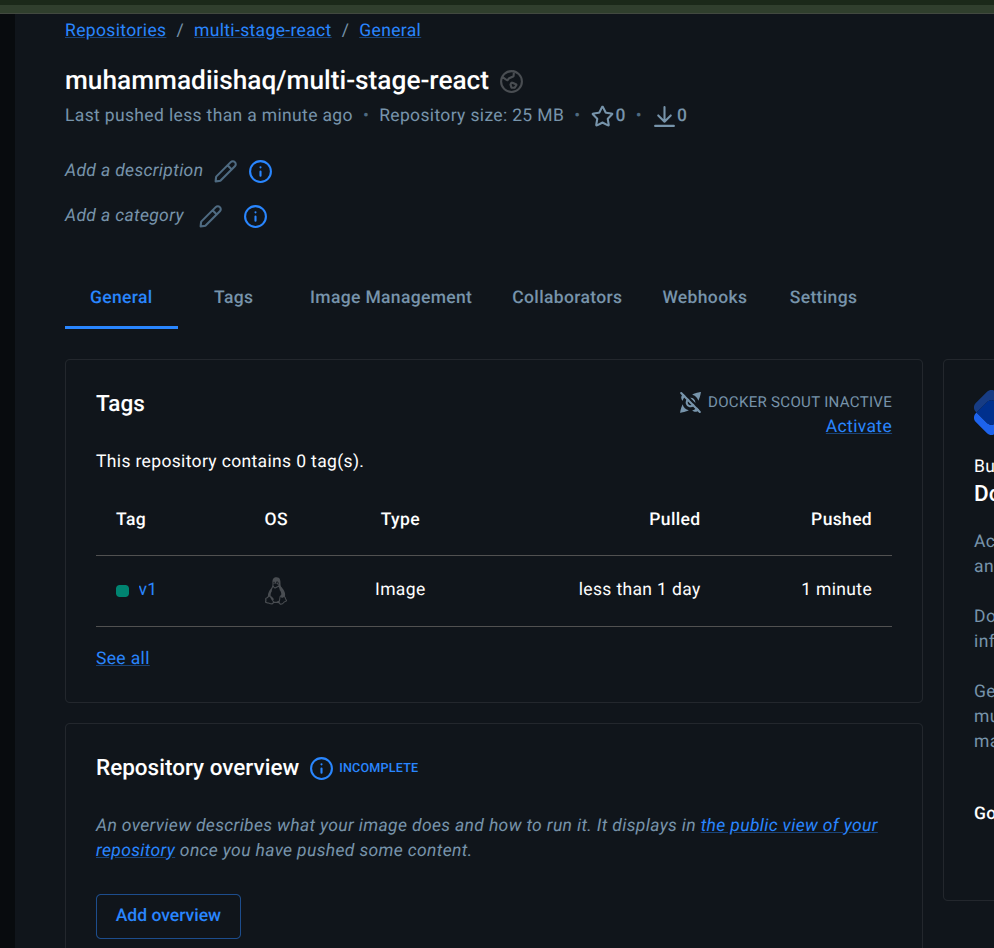

# Day 35 – Multi-Stage Builds & Docker Hub

## Challenge Tasks

### Task 1: The Problem with Large Images
1. Write a simple Go, Java, or Node.js app (even a "Hello World" is fine)
2. Create a Dockerfile that builds and runs it in a **single stage**
3. Build the image and check its **size**

   - Image Size is 452 MB

   
   

   [Dockerfile](Java-Hello/Dockerfile)

---

### Task 2: Multi-Stage Docker Build

1. Rewrite the Dockerfile using multi-stage build:

   - Stage 1: Build the app (install dependencies, compile)
   - Stage 2: Copy only the built artifact into a minimal base image (alpine, distroless, or scratch)
2. Build the image and check its size again

Compare both image sizes:

- Initial image size: 452 MB

- Multi-stage build image size: 255 MB

  

  [Dockerfile](React-app/Dockerfile.multistage)

3. Why is the multi-stage image significantly smaller?

Multi-stage builds reduce image size by clearly separating the build environment from the runtime environment.

During the first stage, all build tools and dependencies are used to compile the application. However, in the final stage, only the compiled artifact is copied into a minimal base image. This means unnecessary tools, caches, and temporary files are excluded from the final image — resulting in a much smaller and cleaner container image.

---

### Task 3: Push to Docker Hub
1. Create a free account on [Docker Hub](https://hub.docker.com) (if you don't have one)
2. Log in from your terminal
3. Tag your image properly: `yourusername/image-name:tag`
4. Push it to Docker Hub
5. Pull it on a different machine (or after removing locally) to verify

  

  

  

---

### Task 4: Docker Hub Repository
1. Go to Docker Hub and check your pushed image
2. Add a **description** to the repository
3. Explore the **tags** tab — understand how versioning works
4. Pull a specific tag vs `latest` — what happens?

   - Pulling a specific tag (for example, 1.0) downloads that exact version of the image.
   - Pulling latest retrieves whichever image is currently assigned as the latest version — this can change over time.

### Key Understanding

Using specific tags ensures consistency and stability because you always get the exact version you expect.

On the other hand, relying on latest can lead to unexpected changes since it may point to a newer image if the repository gets updated.

   

---

### Task 5: Image Best Practices
Apply these to one of your images and rebuild:
1. Use a **minimal base image** (alpine vs ubuntu — compare sizes)
2. **Don't run as root** — add a non-root USER in your Dockerfile
3. Combine `RUN` commands to **reduce layers**
4. Use **specific tags** for base images (not `latest`)

 [Dockerfile](Java-Hello/Dockerfile)

---
